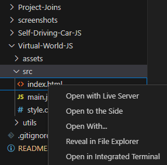

# Neural-Net-Car-JS

## Description
A set of apps in JS with the final purpose of displaying the capabilities of a neural network from scratch in JS.
It contains a virtual world editor for creating and generating the setup. The result will be stored in a file which will be used for the training part.
The project is heavily inspired from the project of professor Radu Marinescu-Istodor, lecturer in Computer Science at University of Eastern Finland.

## Tools and technologies learned
- recap of JS, HTML and CSS
- canvas display, design and load
- OSM (Open Street Map) 
- math fundamentals (ex: distances, projections, etc.)
- graphs and optimization
- neural network fundamentals

## Virtual World Editor
Everything begins with this part, where you have to generate your world and export it.
In order to open the project, navigate to *Virtual-World-JS/src/index.html*. 
You have to serve this file in the browser. A simple solution is the Live Server extension in VS Code.

Simply right-click the file and open using the extension server.

